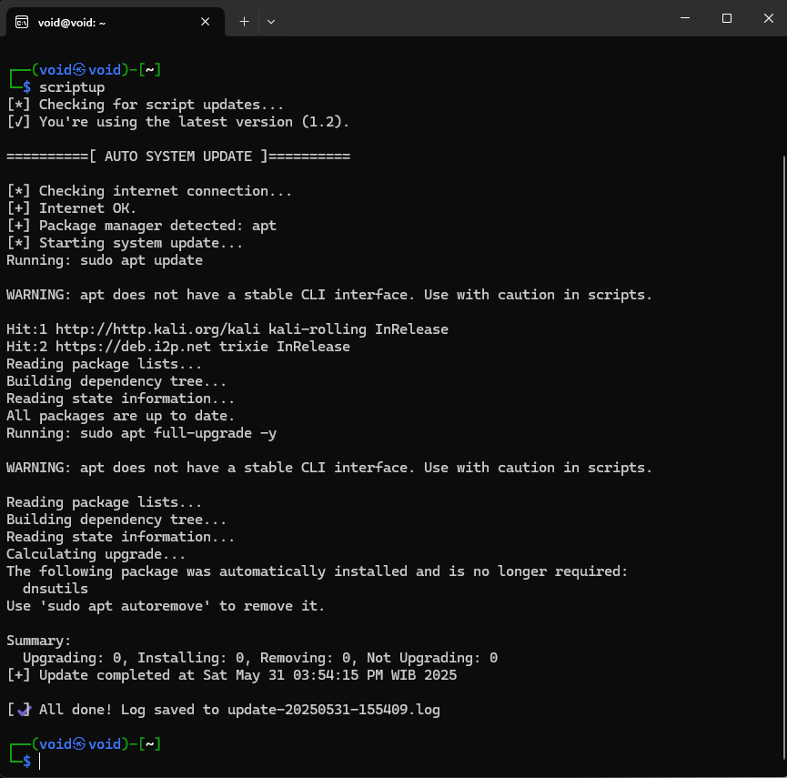
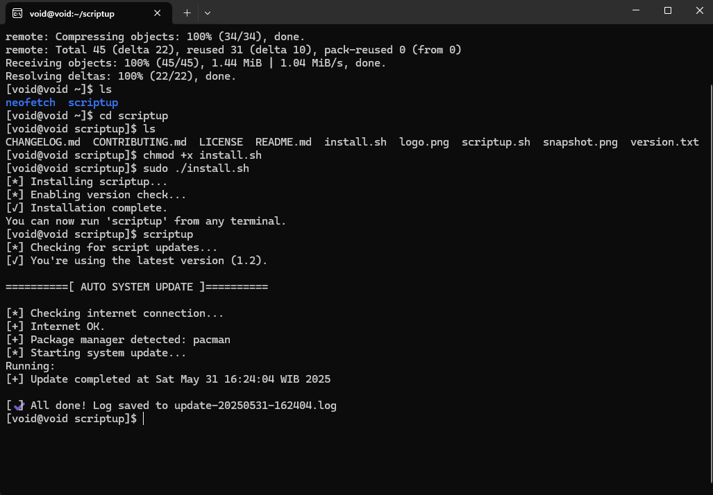

<p align="center">
  
</p>

<h1 align="center">🔄 AutoUpSys</h1>

<p align="center">
  <b>Smart multi-distro Linux updater for hackers, sysadmins, and power users.</b><br>
  <i>Just run once — and update everything with a single command.</i>
</p>

<p align="center">
  
  
  
</p>

---

## ✨ Overview

**AutoUpSys** is a lightweight, intelligent Bash script for system updates on Linux.  
It auto-detects the package manager, checks internet connectivity, performs a complete system update and upgrade, and logs everything with a timestamp.  
Perfect for those who maintain multiple machines or need a unified tool that "just works".

---

## ⚙️ Features

- ✅ **Multi-distro support**: Debian, Ubuntu, Kali, Fedora, Arch, CentOS, openSUSE
- 🌐 **Internet check**: Skips update if no internet
- 🔍 **Package manager detection**: Supports `apt`, `dnf`, `yum`, `pacman`, `zypper`
- 📄 **Auto-logging**: Saves logs as `update-YYYYMMDD-HHMMSS.log`
- 🧠 **Clean Bash**: Minimal, readable, no AI-ish code
- 🔧 **Installer** (`install.sh`): Use `scriptup` globally as a command

---

## 🚀 Quick Start

### ▶️ Run Manually

```bash
chmod +x scriptup.sh
./scriptup.sh
```

### 📥 Install Globally

```bash
chmod +x install.sh
./install.sh
```

Then use from anywhere:

```bash
scriptup
```

---

## 🧪 Output Example

```bash
[*] Checking internet connection...
[+] Internet OK.
[+] Package manager detected: apt
[*] Starting system update...
Running: sudo apt update
Running: sudo apt full-upgrade -y
[+] Update completed at Fri May 30 14:21:04 2025
[✔] All done! Log saved to update-20250530-142104.log
```

---
## 📸 Screenshot

## Kali linux (wsl2)
 <p align="left">
   
 </p>


## Arch (wsl2)
 <p align="left">
   
 </p>

- Tested on Kali linux (wsl2)
- Tested on Arch (wsl2)
---


## 📂 Logs

Each run generates a log file in the same directory:

```
update-YYYYMMDD-HHMMSS.log
```

Example:

```
update-20250530-142104.log
```

---

## 🧠 Requirements

- Linux OS with supported package manager
- `bash` shell
- `sudo` privileges
- Internet connection

---

## 🔧 Files

- `scriptup.sh` → Main updater script
- `install.sh` → Adds `scriptup` command system-wide

---

## 💻 Tested On

- ✅ Kali Linux (WSL2)
- ✅ Ubuntu 22.04
- ✅ Arch Linux (VM)
- ✅ Fedora Workstation
- ✅ Alpine 
- ⚠️ openSUSE (beta support)

---

## 📜 License

This project is licensed under the MIT License.  
Feel free to use, fork, modify, and share.

---

## 🤝 Contributing

Contributions are welcome! Here's how:

### 🧩 How to Contribute

1. **Fork** this repo
2. **Clone** your fork: `git clone https://github.com/Ildhaaannnnnnn/scriptup.git`
3. Create a new branch: `git checkout -b your-feature-branch`
4. Make your changes, commit: `git commit -m "Add feature"`
5. Push to your fork: `git push origin your-feature-branch`
6. Open a **Pull Request** on GitHub

### 💡 Ideas You Can Help With

- Support for Alpine or NixOS
- Better installer with uninstall option
- ZSH-compatible rewrite
- GUI/Zenity wrapper
- Integration with notification system

---

## 🙋‍♂️ Author

**Ildhan** – [GitHub](https://github.com/Ildhaaannnnnnn)  
Script started as a personal tool and is now open for the community.

---

## 🌍 Spread the Word

If you like this project, consider giving it a ⭐ on GitHub and sharing it!  
Let's make Linux updates less annoying.